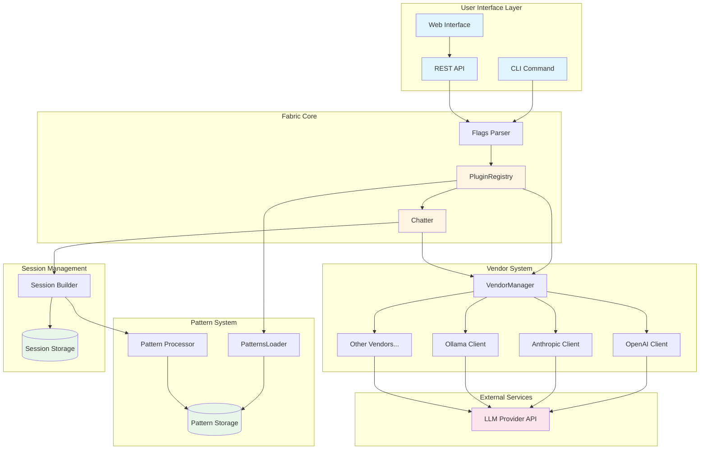
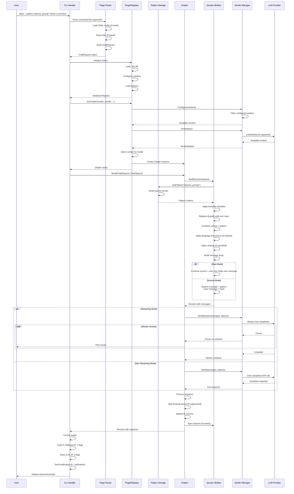

# Fabric Workflow Documentation: `improve_prompt` Pattern

## Executive Summary

This document explains how Fabric processes the `improve_prompt` pattern from a user command to an LLM response. The `improve_prompt` pattern is a specialized prompt that takes an existing LLM prompt as input and outputs an improved version using advanced prompt engineering techniques.

**Key Value Proposition**: The `improve_prompt` pattern helps users create better prompts by applying proven prompt engineering strategies (clear instructions, step-by-step decomposition, reference text, etc.) automatically.

---

## Pattern Overview

### What is `improve_prompt`?

The `improve_prompt` pattern is an expert prompt writing service that:
1. **Takes Input**: An LLM/AI prompt that needs improvement
2. **Applies Knowledge**: Uses comprehensive prompt engineering best practices (from OpenAI's prompt engineering guide)
3. **Produces Output**: An improved version of the input prompt in clean Markdown format

### Pattern Structure

The pattern file (`data/patterns/improve_prompt/system.md`) contains:
- **Identity & Purpose**: Defines the AI's role as an expert prompt writer
- **Knowledge Base**: Extensive prompt engineering strategies and tactics (500+ lines)
- **Processing Steps**: Instructions to interpret, understand, and improve prompts
- **Output Format**: Clean Markdown that can be sent directly to an LLM

---

## Architecture Overview

### Component Diagram



### Key Components Explained

#### 1. **PluginRegistry** (`internal/core/plugin_registry.go`)
- **Purpose**: Central orchestrator that manages all Fabric components
- **Responsibilities**:
  - Initialize and configure vendors (LLM providers)
  - Load patterns from filesystem
  - Manage default settings
  - Coordinate between different subsystems

#### 2. **Chatter** (`internal/core/chatter.go`)
- **Purpose**: Handles the core chat processing logic
- **Responsibilities**:
  - Build session messages from requests
  - Send messages to LLM vendors
  - Handle streaming responses
  - Process responses and apply post-processing

#### 3. **PatternsLoader** (`internal/tools/patterns_loader.go`)
- **Purpose**: Loads and manages pattern files from filesystem
- **Responsibilities**:
  - Scan pattern directories
  - Load pattern content from files
  - Support custom patterns directory
  - Handle pattern updates

#### 4. **VendorManager** (`internal/plugins/ai/vendors.go`)
- **Purpose**: Manages multiple LLM provider integrations
- **Responsibilities**:
  - Filter configured vendors (only use vendors with API keys/config)
  - List available models per vendor
  - Route requests to appropriate vendor
  - Handle vendor-specific configurations

#### 5. **Session Builder** (`internal/core/chatter.go::BuildSession`)
- **Purpose**: Constructs the conversation session from user input
- **Responsibilities**:
  - Load pattern content
  - Apply template variables
  - Combine context, pattern, and user input
  - Format messages for LLM (system/user roles)

---

## Sequence Diagram: Complete Flow



---

## Detailed Flow: Step-by-Step Execution

### Step 1: Command Parsing (`internal/cli/flags.go`)

**Input**: `fabric --pattern improve_prompt "Write a summary"`

**Processing**:
1. Parse command-line flags using `go-flags` library
2. Load YAML config if `--config` flag is provided
3. Check for stdin input (piped data)
4. Build `ChatRequest` object with:
   - Pattern name: `"improve_prompt"`
   - User message: `"Write a summary"`
   - Model/vendor preferences
   - Other options (streaming, temperature, etc.)

**Key Code Locations**:
- `internal/cli/flags.go::BuildChatRequest()`
- `internal/cli/flags.go::Init()`

---

### Step 2: Initialization (`internal/cli/initialization.go`)

**Processing**:
1. Create filesystem database at `~/.config/fabric/`
2. Initialize `PluginRegistry` which:
   - Loads environment variables from `.env` file
   - Creates vendor clients (OpenAI, Anthropic, Ollama, etc.)
   - Initializes pattern loader
   - Configures default settings

**Key Code Locations**:
- `internal/cli/initialization.go::initializeFabric()`
- `internal/core/plugin_registry.go::NewPluginRegistry()`

---

### Step 3: Vendor Selection (`internal/core/plugin_registry.go`)

**Processing**:
1. `GetChatter()` is called to create a Chatter instance
2. VendorManager filters vendors:
   - Only includes vendors that are configured (have API keys/URLs)
   - Checks `vendor.IsConfigured()` for each vendor
3. If model is specified, find which vendor provides it
4. If no model specified, use default model/vendor from config
5. Create Chatter with selected vendor and model

**Key Code Locations**:
- `internal/core/plugin_registry.go::GetChatter()`
- `internal/core/plugin_registry.go::ConfigureVendors()`
- `internal/plugins/ai/vendors.go::GetModels()`

---

### Step 4: Pattern Loading (`internal/plugins/db/fsdb/patterns.go`)

**Processing**:
1. `BuildSession()` calls `db.Patterns.GetApplyVariables()`
2. Pattern loader checks:
   - Custom patterns directory first (if configured)
   - Then main patterns directory: `data/patterns/improve_prompt/system.md`
3. Read pattern file content
4. Apply template variables:
   - Replace `{{input}}` with user's input prompt
   - Replace other variables like `{{variable_name}}` if provided
   - Handle plugin calls like `{{plugin:datetime:now}}`

**Pattern File Location**:
- `data/patterns/improve_prompt/system.md` (519 lines)

**Key Code Locations**:
- `internal/plugins/db/fsdb/patterns.go::GetApplyVariables()`
- `internal/plugins/db/fsdb/patterns.go::getFromDB()`
- `internal/plugins/template/template.go::ApplyTemplate()`

---

### Step 5: Session Building (`internal/core/chatter.go::BuildSession`)

**Processing**:
1. Create or load session (if session name provided)
2. Load context (if context name provided)
3. Load pattern content (already done in Step 4)
4. Combine components:
   ```
   systemMessage = contextContent + patternContent
   ```
5. Apply strategy prompt (if `--strategy` specified)
6. Apply language instructions (if `-g` flag specified)
7. Build message array:
   - **System message**: Contains the full `improve_prompt` pattern (519 lines)
   - **User message**: Contains the input prompt to improve

**Message Structure Example**:
```json
[
  {
    "role": "system",
    "content": "# IDENTITY and PURPOSE\n\nYou are an expert LLM prompt writing service...\n\n# INPUT\n\nThe following is the prompt you will improve:\n"
  },
  {
    "role": "user",
    "content": "Write a summary"
  }
]
```

**Key Code Locations**:
- `internal/core/chatter.go::BuildSession()` (lines 145-281)

---

### Step 6: LLM Communication (`internal/core/chatter.go::Send`)

**Processing**:
1. Get vendor messages from session
2. Check if streaming mode is enabled
3. Send to vendor:
   - **Streaming**: `vendor.SendStream()` → chunks arrive via channel
   - **Non-streaming**: `vendor.Send()` → complete response
4. Handle vendor-specific requirements:
   - Some models need "raw mode" (system + user combined)
   - Some models support thinking/reasoning tokens
   - Some models support function calling

**Key Code Locations**:
- `internal/core/chatter.go::Send()` (lines 34-143)
- Vendor-specific implementations in `internal/plugins/ai/*/`

---

### Step 7: Response Processing (`internal/core/chatter.go`)

**Processing**:
1. Collect response chunks (if streaming) into full message
2. Strip thinking blocks if `--suppress-think` flag is set
3. Validate response is not empty
4. Append assistant response to session
5. Save session to filesystem (if named session)

**Key Code Locations**:
- `internal/core/chatter.go::Send()` (lines 106-143)
- `internal/domain/think.go::StripThinkBlocks()`

---

### Step 8: Output Handling (`internal/cli/chat.go`)

**Processing**:
1. Extract final response from session
2. Print to stdout (if not already streamed)
3. Copy to clipboard (if `-c` flag)
4. Save to file (if `-o` flag)
5. Send desktop notification (if `--notification` flag)

**Key Code Locations**:
- `internal/cli/chat.go::handleChatProcessing()` (lines 18-145)

---

## Data Flow: `improve_prompt` Example

### Input Transformation

**User Input**:
```bash
fabric --pattern improve_prompt "Summarize this article"
```

**After Pattern Loading**:
```markdown
# IDENTITY and PURPOSE

You are an expert LLM prompt writing service. You take an LLM/AI prompt as input and output a better prompt...

[500+ lines of prompt engineering knowledge]

# INPUT

The following is the prompt you will improve:

Summarize this article
```

**LLM Request** (simplified):
```json
{
  "messages": [
    {
      "role": "system",
      "content": "[Full improve_prompt pattern]"
    },
    {
      "role": "user", 
      "content": "Summarize this article"
    }
  ],
  "model": "gpt-4",
  "temperature": 0.7
}
```

**LLM Response** (example):
```markdown
# IDENTITY and PURPOSE

You are an expert content summarization assistant...

# STEPS:

1. Read the provided article carefully
2. Identify key points and main arguments
3. Create a concise summary that captures the essence...

# OUTPUT FORMAT:

- Provide a 2-3 sentence summary
- Include the main topic and key conclusions
- Use clear, professional language

# INPUT

The following is the article to summarize:
```

---

## Key Design Patterns

### 1. **Plugin Architecture**
- Vendors are pluggable components
- Each vendor implements the `Vendor` interface
- Easy to add new LLM providers

### 2. **Pattern System**
- Patterns are markdown files in filesystem
- Support template variables and plugins
- Custom patterns can override built-in patterns

### 3. **Session Management**
- Sessions store conversation history
- Can be named and persisted
- Support context and multi-turn conversations

### 4. **Configuration Hierarchy**
1. Environment variables (`.env` file)
2. YAML config file (if specified)
3. Command-line flags (highest priority)

---

## Error Handling

### Common Error Scenarios

1. **Pattern Not Found**
   - Error: `could not get pattern improve_prompt`
   - Location: `internal/plugins/db/fsdb/patterns.go::getFromDB()`
   - Resolution: Pattern file missing or wrong path

2. **No Configured Vendors**
   - Error: `no AI vendors configured`
   - Location: `internal/plugins/ai/vendors.go::readModels()`
   - Resolution: Run `fabric --setup` to configure at least one vendor

3. **Model Not Available**
   - Error: `model X not available for vendor Y`
   - Location: `internal/core/plugin_registry.go::GetChatter()`
   - Resolution: Check model name or configure different vendor

4. **API Key Missing**
   - Error: Vendor-specific error (e.g., "OpenAI API key not configured")
   - Location: Vendor `Configure()` methods
   - Resolution: Set API key in `.env` file or via `fabric --setup`

---

## Performance Considerations

### Caching
- Pattern files are read from disk each time (no caching)
- Vendor model lists are cached in `VendorsModels` object
- Sessions are persisted to disk for named sessions

### Streaming
- Streaming mode provides real-time feedback
- Reduces perceived latency
- Uses goroutines and channels for concurrent processing

### Parallel Processing
- Vendor model listing happens in parallel (goroutines)
- Multiple patterns can be processed concurrently via REST API

---

## Extension Points

### Adding a New Pattern
1. Create directory: `data/patterns/your_pattern_name/`
2. Add `system.md` file with pattern content
3. Use `{{input}}` placeholder for user input
4. Run `fabric --updatepatterns` to refresh

### Adding a New Vendor
1. Implement `Vendor` interface in `internal/plugins/ai/vendor_name/`
2. Add to `NewPluginRegistry()` in `plugin_registry.go`
3. Implement `Configure()`, `IsConfigured()`, `ListModels()`, `Send()`, `SendStream()`

### Custom Strategies
1. Add JSON file to `data/strategies/`
2. Contains `prompt` field with strategy instructions
3. Applied via `--strategy` flag

---

## Testing the Flow

### Dry Run Mode
```bash
fabric --pattern improve_prompt --dry-run "Test prompt"
```
- Shows what would be sent to LLM
- No actual API calls
- Useful for debugging pattern formatting

### Debug Mode
```bash
fabric --pattern improve_prompt --debug=2 "Test prompt"
```
- Level 0: Off (default)
- Level 1: Basic debug info
- Level 2: Detailed debugging
- Level 3: Trace level

---

## Summary for Product Managers

### What Happens in 30 Seconds?

1. **User runs command** → Fabric parses arguments
2. **System initializes** → Loads config, patterns, vendors (cached after first run)
3. **Pattern loaded** → Reads `improve_prompt` pattern from disk
4. **Session built** → Combines pattern + user input into LLM messages
5. **LLM called** → Sends request to configured provider (OpenAI, Anthropic, etc.)
6. **Response processed** → Improved prompt received from LLM
7. **Output formatted** → Displayed to user, optionally saved/copied

### Key Metrics to Track
- **Pattern Load Time**: How long to read pattern files
- **Vendor Response Time**: LLM API latency
- **End-to-End Latency**: Total time from command to output
- **Error Rate**: Frequency of failed requests

### User Value
- **No API Key Required**: Can use Ollama (local) for free
- **Reusable Patterns**: 298+ built-in patterns available
- **Flexible**: Works with any LLM provider
- **Extensible**: Easy to add custom patterns

---

## Appendix: File Locations

### Core Components
- CLI Handler: `internal/cli/cli.go`
- Chat Processing: `internal/cli/chat.go`
- Flags Parser: `internal/cli/flags.go`
- Chatter Core: `internal/core/chatter.go`
- Plugin Registry: `internal/core/plugin_registry.go`

### Pattern System
- Pattern Storage: `internal/plugins/db/fsdb/patterns.go`
- Pattern Loader: `internal/tools/patterns_loader.go`
- Template Processing: `internal/plugins/template/template.go`

### Vendor System
- Vendor Manager: `internal/plugins/ai/vendors.go`
- OpenAI Client: `internal/plugins/ai/openai/`
- Anthropic Client: `internal/plugins/ai/anthropic/`
- Ollama Client: `internal/plugins/ai/ollama/`

### Pattern Files
- Improve Prompt: `data/patterns/improve_prompt/system.md`
- All Patterns: `data/patterns/`

---

*Document generated for Fabric project understanding and product management purposes.*

